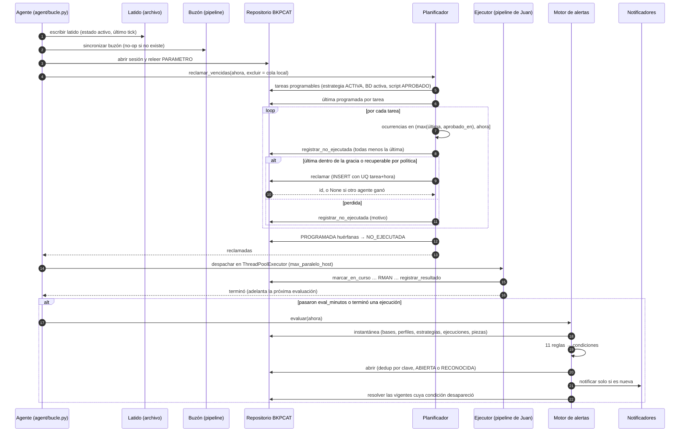
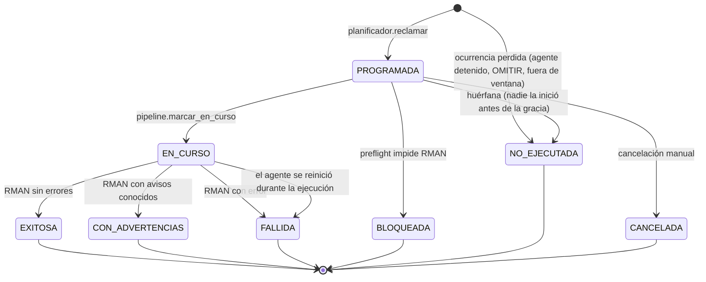
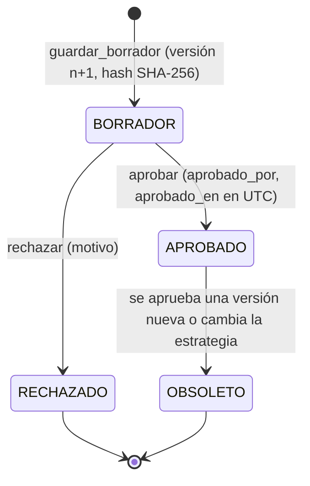
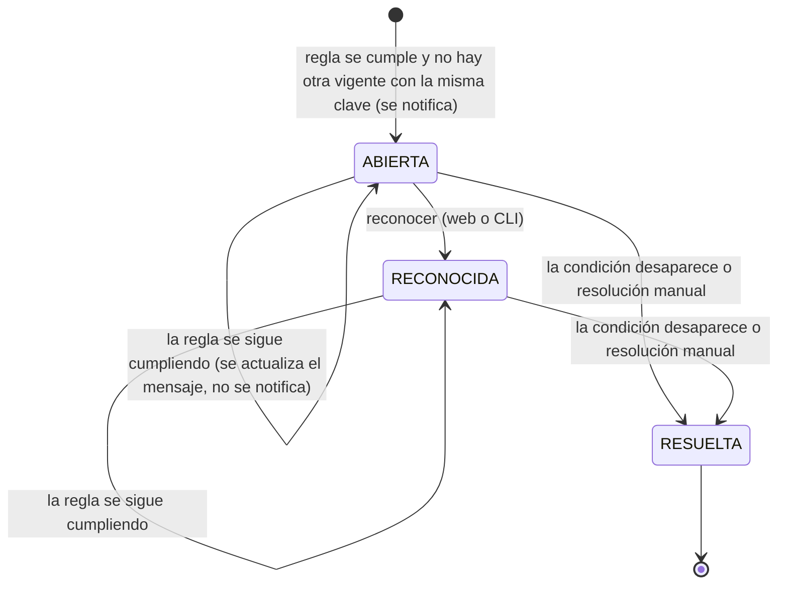
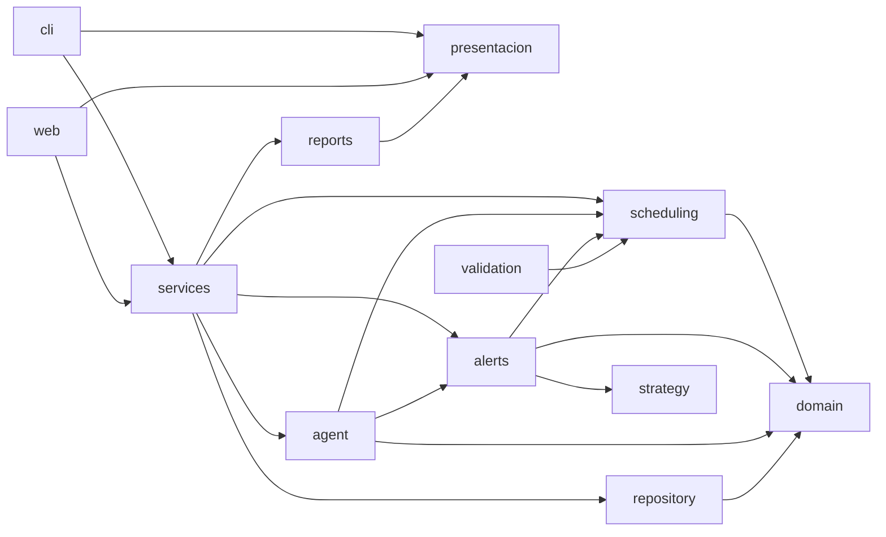

# Diagramas del agente, la ejecución y las alertas

Diagramas del carril de Alejandro para integrar en `docs/diseno.md` (Josué). Están en Mermaid; GitHub y VS Code los dibujan directamente.

## 1. Secuencia de un tick del agente

## 2. Estados de una ejecución (`EJECUCION.estado`)

`estado_prueba` evoluciona aparte: `PENDIENTE → OK | FALLIDA` cuando corre la verificación; `NO_APLICA` para NO_EJECUTADA, interrumpidas y simulaciones.

## 3. Estados de un script RMAN (`SCRIPT_RMAN.estado`)

Solo un script `APROBADO` por tarea hace que la tarea sea programable. `aprobado_en` es la cota inferior desde la que el planificador busca ocurrencias perdidas.

## 4. Estados de una alerta (`ALERTA.estado`)

`ABIERTA` y `RECONOCIDA` son «vigentes»: ambas cuentan para la deduplicación y para la resolución automática. Las alertas de evento (`SCRIPT_ALTERADO`, `BASE_NO_REABIERTA`) no se resuelven solas.

## 5. Dependencias entre paquetes (medidas)

Medido con un análisis de imports el 03/10/2026: sin ciclos; `scheduling` y `alerts` no importan `web`, `cli` ni `presentacion`; los archivos nuevos de `cli` y `web` no importan `repository`, `oracle` ni `execution`.
