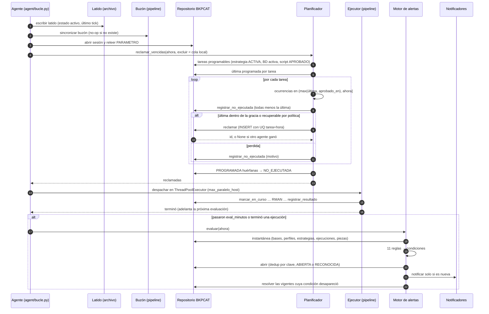
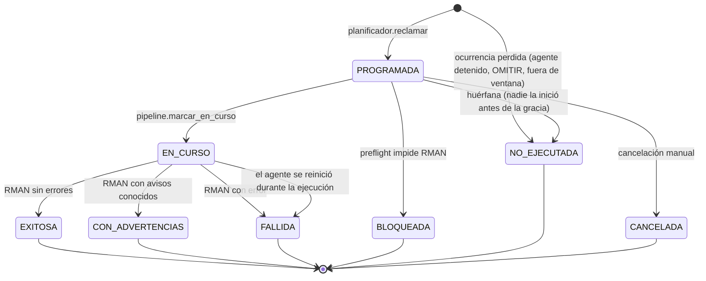
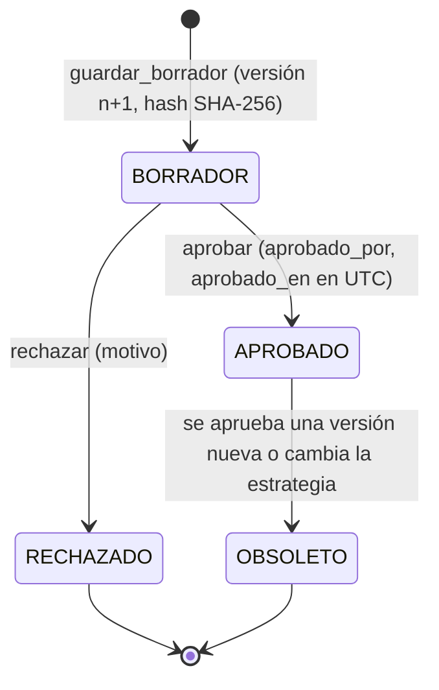
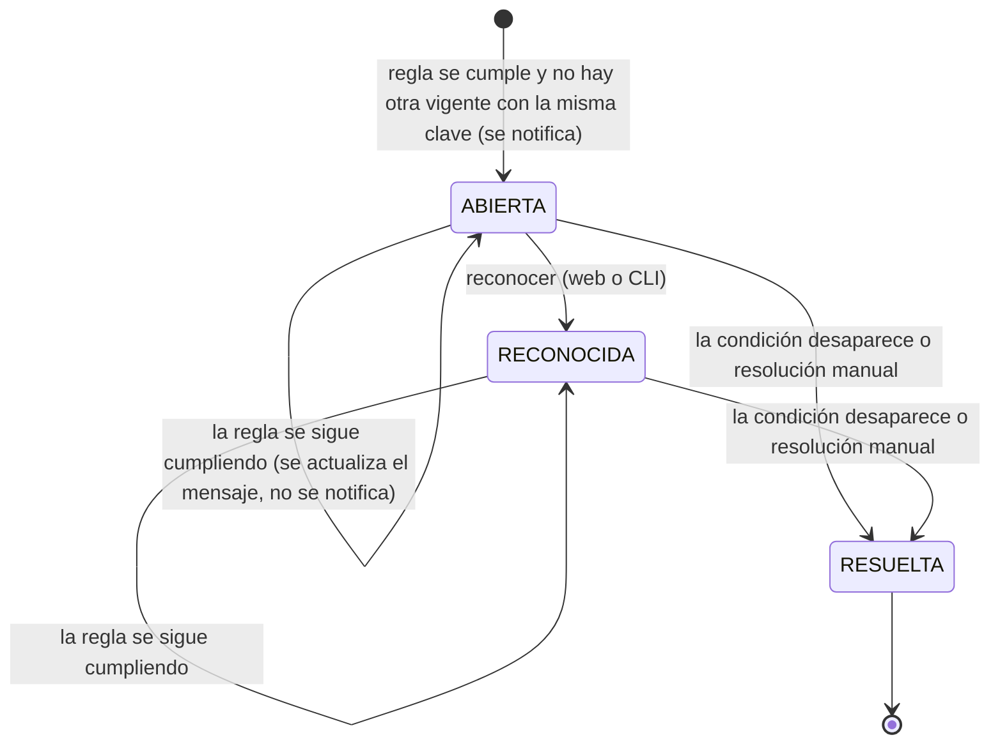
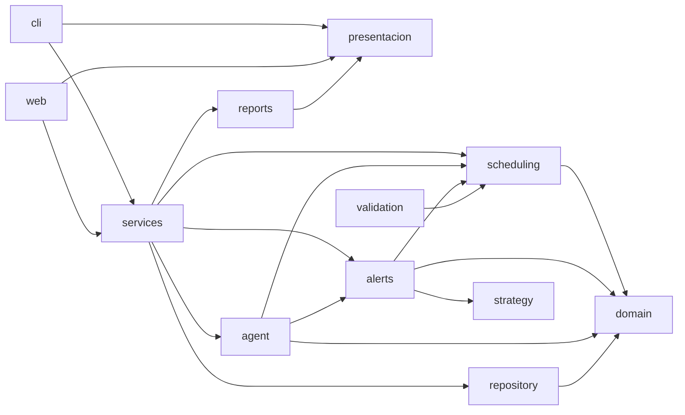

# Diseño — CloudCR Oracle Backup

Documento de arquitectura, modelo de datos, máquinas de estado, diagramas de secuencia y diseño de interfaz, correspondiente a la sección 11 del plan de acción (entregable de diseño).

---

## 1. Arquitectura

### 1.1 Capas

```
                    CLI (typer)                     Web (FastAPI + HTMX, solo lectura)
                       │                                         │
                       └──────────────────┬──────────────────────┘
                                          │  ambas usan solo services/ y presentacion/
 ┌────────────────────────────────────────┴──────────────────────────────────────────┐
 │  services/                                                                        │
 │  estrategias · scripts · ejecuciones · retencion · recuperacion · alertas ·       │
 │  historial · monitoreo                                                            │
 └───────┬────────────┬───────────┬────────────┬───────────┬────────────┬────────────┘
         │             │           │            │           │            │
   strategy/      validation/   rman/      execution/   verification/  alerts/
   (qué/cómo/      (34 reglas,  (constructor, (pipeline, (CROSSCHECK +  (motor, 11
    cuándo,        4 niveles)    plantillas,   preflight,  existencia +   reglas, A1-
    asistente,                   aprobación)   runner,     VALIDATE)      A14)
    YAML)                                      parser,
                                                clasificador)
         │             │           │            │           │            │
         └─────────────┴───────────┴──────┬─────┴───────────┴────────────┘
                                          │
                              ┌───────────┴────────────┐
                              │      repository/        │
                              │  (único punto de SQL     │
                              │   contra el repositorio) │
                              └───────────┬─────────────┘
                                          │
                    ┌─────────────────────┼───────────────────────┐
                    │                     │                       │
           ┌────────┴────────┐  ┌─────────┴─────────┐  ┌──────────┴──────────┐
           │  oracle/          │  │  BKPCAT (PDB)      │  │  execution/runner    │
           │  oracledb thick   │  │  BKP_ADMIN, 12     │  │  subprocess → rman   │
           │  inspector local  │  │  tablas (thin)     │  │                      │
           └────────┬──────────┘  └────────────────────┘  └──────────┬──────────┘
                    │                                                 │
              XE (BD objetivo)                               C:\backups\XE
```

**Regla que nadie rompe:** la CLI y la web nunca ejecutan SQL ni RMAN directamente — siempre pasan por `services/`, que a su vez llama a `repository/` (SQL) o a `rman/`/`execution/` (RMAN). `repository/` es el único paquete autorizado a escribir sentencias SQL contra `BKPCAT`.

**Desviaciones conocidas de esa regla (decisión consciente).** Cuatro grupos de archivos de la interfaz importan `oracle/` o `repository/` directamente en lugar de pasar por `services/`:

| Dónde | Qué importa | Por qué se acepta |
|---|---|---|
| `cli/cmd_db.py`, `cmd_repo.py`, `cmd_param.py` | `repository/` y `oracle/connection` | Son los comandos de instalación y registro más antiguos, anteriores a la capa `services/`. La web ya tiene su equivalente en `services/administracion.py` y `services/bases_datos.py` |
| `cli/cmd_estrategia.py`, `asistente_estrategia.py` | `repository/`, `oracle/explorador` | Trabajan con un archivo YAML y con la inspección local de la instancia (modo *thick*), sin repositorio; la restricción de 1.1 obliga a ordenar esas dos conexiones dentro del mismo comando |
| `cli/cmd_explorar.py`, `web/dependencias.py`, `web/rutas/instancias.py`, `comun.py`, `estrategias.py` | `oracle/discovery`, `oracle/explorador`, `oracle/connection` | El explorador de instancias es el módulo original del proyecto; sus tipos de dato (`Exploracion`, errores de conexión) se usan en la presentación |
| `web/rutas/sistema.py` | `repository.bases_datos.Ambiente` | Solo importa una enumeración, no ejecuta SQL |

Ninguno de ellos escribe SQL ni invoca RMAN: toda sentencia contra `BKPCAT` sigue viviendo en `repository/` y todo RMAN en `execution/`. Mover estos comandos a `services/` es deuda técnica registrada: no cambia ningún comportamiento y sus pruebas actuales dependen de la forma en que hoy llaman a esos módulos, por lo que se dejó fuera del alcance de la entrega.

**Restricción técnica real descubierta en desarrollo:** `python-oracledb` no permite mezclar modo *thin* (usuario/clave, para el repositorio) y modo *thick* (autenticación de sistema operativo, para inspeccionar la base objetivo) en el mismo proceso. Cualquier comando que necesite las dos conexiones debe completar primero toda la parte thick (inspección local) y recién después abrir la conexión al repositorio.

### 1.2 Carpeta de trabajo en ejecución

```
<work_dir>/
├── scripts/<BD>/<ESTRATEGIA>/<TAREA>_v<N>.rman
├── ejecuciones/<BD>/<AAAA>/<MM>/<id>/
│   ├── script.rman
│   ├── rman.log
│   ├── verificacion.log
│   └── evidencia.json
├── recuperacion/<BD>/<escenario>_<fecha>.rman
├── buzon/<timestamp>_<id>.json
└── logs/cloudcr.log
```

El destino de los respaldos (`C:\backups\XE` por defecto, configurable con `CLOUDCR_DESTINO_DEFECTO`) es independiente de la carpeta de trabajo.

### 1.3 El repositorio dentro de la misma instancia que se respalda

`BKPCAT` es una PDB de la misma CDB `XE` que se respalda. Un respaldo en modo `CONSISTENTE` apaga la base con `SHUTDOWN IMMEDIATE`, lo que apagaría también el repositorio a mitad de la ejecución. Tres medidas lo resuelven:

1. **Evidencia primero a disco:** `execution/evidencia.py` escribe `evidencia.json`, `script.rman` y `rman.log` en la carpeta de trabajo antes de tocar el repositorio.
2. **Buzón:** si el `INSERT` al repositorio falla (por ejemplo porque la base está apagada), el registro queda en `<work_dir>/buzon/` y se sincroniza en el siguiente tick del agente.
3. **La demo principal corre en modo `EN_LINEA`** (ARCHIVELOG), sin apagar nada. El modo `CONSISTENTE` es la excepción, reservada para una base en NOARCHIVELOG.

---

## 2. Módulos y responsabilidades

| Paquete | Responsabilidad | Quién no debe tocarlo directo |
|---|---|---|
| `domain/` | Modelos pydantic puros, sin E/S: `Estrategia`, `Tarea`, `Programacion`, `Condicion` (alertas), enumerados | — (todos lo importan) |
| `config/` | Configuración con precedencia flag → variable de entorno → YAML → valor por defecto; layout de la carpeta de trabajo | — |
| `repository/` | Única capa con SQL contra `BKPCAT`: `conexion`, `esquema`, `parametros`, `bases_datos`, `estrategias`, `scripts`, `ejecuciones`, `piezas`, `alertas` | CLI y web, directo |
| `oracle/` | Descubrimiento de instancias, conexión thick/SYSDBA, inspección de la base objetivo (`PerfilBD`), 14+ reglas de observación | — |
| `strategy/` | Servicio de estrategias (crear/editar/versionar), YAML, asistente interactivo, criterios de prioridad, plantillas de esquema | — |
| `validation/` | Motor de reglas (34 códigos, 4 severidades) que valida una estrategia contra el perfil real de la base | — |
| `rman/` | Traduce una `Tarea` a sentencias RMAN: objetos de alcance, nombres/tags, plantillas Jinja2, aprobación con hash SHA-256 | Todo lo demás llama a `services/scripts.py`, no a `rman/` directo |
| `execution/` | Pipeline de ejecución: preflight, runner (subprocess), parser de log, correlador con vistas `V$`, clasificador, evidencia, buzón | — |
| `verification/` | `CROSSCHECK` + existencia en disco + `VALIDATE` → columna Pruebas | — |
| `retention/` | Informe de piezas obsoletas y purga controlada, limitada a las piezas de la propia estrategia | — |
| `recovery/` | Diagnóstico con `V$RECOVER_FILE`, puntos de recuperación, generación de procedimientos (nunca los ejecuta) | — |
| `scheduling/` | Recurrencia (`dateutil.rrule`), ventanas de respaldo, planificador de próximas ejecuciones | — |
| `agent/` | Bucle continuo: reclama ejecuciones vencidas, las despacha, sincroniza el buzón, evalúa alertas | — |
| `alerts/` | Motor de 11+ reglas de alerta, deduplicación por `clave_dedup`, notificadores (consola, correo) | — |
| `services/` | Capa de orquestación que CLI y web consumen; traduce excepciones de dominio a resultados de servicio | — |
| `presentacion/` | Modelos neutros de árbol/tabla compartidos entre CLI y web, para no duplicar la lógica de formato | — |
| `reports/` | Exportación a JSON, Markdown y HTML | — |
| `cli/` | Un archivo `cmd_*.py` por área, cada uno dueño exclusivo de su archivo; `app.py` solo registra sub-aplicaciones | — |
| `web/` | FastAPI + HTMX, solo lectura; API JSON para historial, alertas, scripts, ejecuciones, retención y recuperación | — |

---

## 3. Modelo de datos

### 3.1 Diagrama entidad-relación

```
BD_REGISTRADA 1──N PERFIL_BD
      │
      1──N ESTRATEGIA 1──N ESTRATEGIA_OBJETO          (el QUÉ + prioridad)
                │
                1──N TAREA 1──1 PROGRAMACION          (el CÓMO + el CUÁNDO)
                       │
                       1──N SCRIPT_RMAN
                       │           │
                       1──N EJECUCION N──1 (SCRIPT_RMAN)
                                     ├──N EJECUCION_PIEZA
                                     └──N VERIFICACION

ALERTA N──1 (BD_REGISTRADA | ESTRATEGIA | TAREA | EJECUCION, todas opcionales)
PARAMETRO (clave/valor global, sin relaciones)
```

### 3.2 Diccionario de datos — las 12 tablas de `BKP_ADMIN`

**`PARAMETRO`** — configuración global clave/valor.

| Columna | Tipo | Notas |
|---|---|---|
| `clave` | VARCHAR2(100) PK | |
| `valor` | VARCHAR2(4000) NOT NULL | |

**`BD_REGISTRADA`** — qué bases de datos administra el sistema.

| Columna | Tipo | Notas |
|---|---|---|
| `id` | NUMBER PK (IDENTITY) | |
| `nombre` | VARCHAR2(30) UNIQUE NOT NULL | |
| `oracle_home` | VARCHAR2(400) NOT NULL | |
| `ambiente` | VARCHAR2(20) CHECK | `PRODUCCION` / `PRUEBAS` / `DESARROLLO` — las operaciones de recuperación solo se ofrecen en `PRUEBAS` |
| `activa` | CHAR(1) CHECK | `S` / `N` |
| `creada_en` | TIMESTAMP | |

**`PERFIL_BD`** — snapshot del estado de una base en el momento de cada inspección.

| Columna | Tipo | Notas |
|---|---|---|
| `id` | NUMBER PK | |
| `bd_id` | NUMBER FK → BD_REGISTRADA | |
| `log_mode` | VARCHAR2(20) CHECK | `ARCHIVELOG` / `NOARCHIVELOG` |
| `contenido_json` | CLOB NOT NULL | El `PerfilBD` completo serializado (pydantic `model_dump_json`) |
| `capturado_en` | TIMESTAMP | Permite reconstruir el `log_mode` vigente al momento de aprobar un script (`log_mode_al_crear_script`) |

**`ESTRATEGIA`** — la decisión central: qué prioridad, qué política de retención, versión.

| Columna | Tipo | Notas |
|---|---|---|
| `id` | NUMBER PK | |
| `bd_id` | NUMBER FK | |
| `codigo` | VARCHAR2(20) | `UNIQUE(bd_id, codigo)` |
| `nombre`, `descripcion` | VARCHAR2 | |
| `prioridad` | VARCHAR2(10) CHECK | `ALTA` / `MEDIA` / `BAJA` |
| `estado` | VARCHAR2(10) CHECK | `ACTIVA` / `INACTIVA` |
| `version` | NUMBER | Se incrementa en cada `editar`; no se versiona por fila, se actualiza la misma |
| `creada_por`, `creada_en` | | |
| `retencion_ventana_dias`, `retencion_redundancia` | NUMBER | Mutuamente excluyentes (`CHECK`) |
| `retencion_archivelog_dias` | NUMBER | |
| `retencion_purga_automatica` | CHAR(1) | Si es `N`, el sistema solo informa, nunca borra |

**`ESTRATEGIA_OBJETO`** — el **qué** respaldar (1 estrategia → N objetos).

| Columna | Tipo | Notas |
|---|---|---|
| `id` | NUMBER PK | |
| `estrategia_id` | NUMBER FK | |
| `tipo_objeto` | VARCHAR2(20) CHECK | `BASE_DATOS`, `PDB`, `TABLESPACE`, `DATAFILE`, `CONTROLFILE`, `SPFILE`, `ARCHIVELOG` |
| `identificador` | VARCHAR2(200) **NULL permitido** | `NULL`/vacío significa "toda la base" (`BASE_DATOS`, `CONTROLFILE`, `SPFILE`, `ARCHIVELOG`). *Nota de diseño: Oracle trata `''` como `NULL`; la columna se corrigió a nullable tras un `ORA-01400` real al guardar una estrategia de alcance completo.* |
| `prioridad` | VARCHAR2(10) CHECK | |

**`TAREA`** — el **cómo** (1 estrategia → N tareas).

| Columna | Tipo | Notas |
|---|---|---|
| `id` | NUMBER PK | |
| `estrategia_id` | NUMBER FK | `UNIQUE(estrategia_id, codigo)` |
| `tipo_respaldo` | VARCHAR2(30) CHECK | `COMPLETO`, `INCREMENTAL_N0`, `INCREMENTAL_N1_DIFERENCIAL`, `INCREMENTAL_N1_ACUMULATIVO`, `ARCHIVELOG` |
| `modo_respaldo` | VARCHAR2(15) CHECK | `AUTO`, `EN_LINEA`, `CONSISTENTE` |
| `compresion` | VARCHAR2(10) CHECK | XE solo soporta `NINGUNA`/`BASIC`, validado en `validation/`, no en la base |
| `canales` | NUMBER | |
| `destino_ruta`, `destino_etiqueta` | VARCHAR2 | |
| `omitir_solo_lectura` | CHAR(1) | `SKIP READONLY` en el script generado |

**`PROGRAMACION`** — el **cuándo** (1 tarea → 1 programación).

| Columna | Tipo | Notas |
|---|---|---|
| `tarea_id` | NUMBER FK **UNIQUE** | Relación 1 a 1 |
| `tipo_frecuencia` | VARCHAR2(15) CHECK | `UNA_VEZ`, `INTERVALO`, `DIARIA`, `SEMANAL`, `MENSUAL` |
| `horas` | VARCHAR2(200) | Lista de horas `HH:MM` separadas por coma |
| `dias_semana` | VARCHAR2(50) | Lista de códigos (`LUN`,`MAR`...) separados por coma |
| `intervalo_minutos` | NUMBER | |
| `fecha_inicio` | DATE | |
| `ventana_inicio`, `ventana_fin` | VARCHAR2(5) | Ventana de respaldo, admite cruzar medianoche |
| `zona_horaria` | VARCHAR2(60) | Por defecto `America/Costa_Rica` |
| `politica_omision` | VARCHAR2(25) CHECK | Qué hacer si se pierde la ventana |

**`SCRIPT_RMAN`** — el script generado, su hash y su aprobación.

| Columna | Tipo | Notas |
|---|---|---|
| `id` | NUMBER PK | |
| `tarea_id` | NUMBER FK | `UNIQUE(tarea_id, version)` |
| `version` | NUMBER | Autoincremental por tarea |
| `contenido` | CLOB NOT NULL | El script RMAN completo |
| `hash_sha256` | VARCHAR2(64) | Calculado al guardar el borrador; si el archivo en disco no coincide al ejecutar, la ejecución queda `BLOQUEADA` (`SCRIPT_ALTERADO`) |
| `estado` | VARCHAR2(15) CHECK | `BORRADOR` → `APROBADO`/`RECHAZADO` → `OBSOLETO` |
| `aprobado_por`, `aprobado_en` | | |
| `acepto_caida` | CHAR(1) | Obligatorio en `S` para aprobar un script en modo `CONSISTENTE` |
| `motivo_rechazo` | VARCHAR2(1000) | *Columna agregada durante el desarrollo: faltaba dónde guardar el motivo de un rechazo* |

**`EJECUCION`** — el resultado de correr un script (los 13 campos que exige el enunciado).

| Columna | Tipo | Notas |
|---|---|---|
| `id` | NUMBER PK | |
| `tarea_id`, `script_id`, `bd_id` | NUMBER FK | |
| `programada_para` | TIMESTAMP | `UNIQUE(tarea_id, programada_para)` — evita que dos procesos del agente dupliquen la misma ocurrencia |
| `inicio`, `fin` | TIMESTAMP | |
| `estado` | VARCHAR2(20) CHECK | `PROGRAMADA`, `EN_CURSO`, `EXITOSA`, `CON_ADVERTENCIAS`, `FALLIDA`, `NO_EJECUTADA`, `BLOQUEADA`, `CANCELADA` |
| `tipo_respaldo`, `agente` | | `agente` guarda el hostname, sin tabla `AGENTE` separada |
| `ubicacion`, `archivos_generados`, `tamano_bytes`, `duracion_segundos` | | |
| `mensaje_rman` | VARCHAR2(4000) | |
| `errores`, `advertencias` | CLOB | |
| `estado_prueba` | VARCHAR2(15) CHECK | Columna **Pruebas** del enunciado |

Índice: `ix_ejecucion_estado (estado, programada_para)`, para que el agente encuentre rápido las ejecuciones vencidas.

**`EJECUCION_PIEZA`** — los archivos físicos que produjo una ejecución.

| Columna | Tipo | Notas |
|---|---|---|
| `ejecucion_id` | NUMBER FK | |
| `nombre_archivo`, `tamano_bytes`, `tag` | | |
| `vence_en` | TIMESTAMP | Calculado desde la política de retención de la estrategia |
| `obsoleta` | CHAR(1) | Para el informe de `retention/` |

**`VERIFICACION`** — resultado de validar un respaldo después de hecho.

| Columna | Tipo | Notas |
|---|---|---|
| `ejecucion_id` | NUMBER FK | |
| `tipo_prueba` | VARCHAR2(30) | `CROSSCHECK`, existencia en disco, `VALIDATE` |
| `resultado` | VARCHAR2(15) CHECK | `PENDIENTE`, `OK`, `FALLIDA`, `NO_APLICA` |
| `detalle` | CLOB | |

**`ALERTA`** — condiciones que requieren atención del DBA.

| Columna | Tipo | Notas |
|---|---|---|
| `codigo` | VARCHAR2(40) | Uno de los ~11-14 códigos de `alerts/` (`BD_NOARCHIVELOG`, `EJECUCION_FALLIDA`, `RETENCION_VENCIDA`, etc.) |
| `clave_dedup` | VARCHAR2(200) | Evita alertas duplicadas para la misma condición |
| `severidad` | VARCHAR2(15) | |
| `estado` | VARCHAR2(15) CHECK | `ABIERTA` → `RECONOCIDA` → `RESUELTA` (`RECONOCIDA` sigue considerándose vigente para deduplicación) |
| `bd_id`, `estrategia_id`, `tarea_id`, `ejecucion_id` | NUMBER FK, todos NULL permitido | Una alerta puede no estar atada a nada específico |
| `abierta_en`, `resuelta_en` | TIMESTAMP | |

Índice: `ix_alerta_abierta (estado, clave_dedup)`.

### 3.3 Decisiones de diseño explícitas

- **Sin tabla `AGENTE`:** un solo host en la demo; `EJECUCION.agente` guarda el hostname.
- **Sin tabla `AUDITORIA`:** se cubre con `creada_por` en `ESTRATEGIA` y `aprobado_por` en `SCRIPT_RMAN`.
- **La estrategia no se versiona como filas separadas:** `editar` actualiza la misma fila de `ESTRATEGIA` y sube `version`; el historial real y auditable vive en `SCRIPT_RMAN`, donde cada versión de script sí queda como fila propia y las anteriores pasan a `OBSOLETO`.
- **`ESTRATEGIA_OBJETO.identificador` admite `NULL`:** decisión corregida durante el desarrollo — Oracle no distingue `''` de `NULL` en `VARCHAR2`, y la convención del dominio usa `identificador=""` para "toda la base".

---

## 4. Máquinas de estado

### 4.1 `EstadoEstrategia`

```
ACTIVA ⇄ INACTIVA
```
Transición libre en ambos sentidos vía `cloudcr estrategia activar/desactivar`. Solo las estrategias `ACTIVA` las toma el agente.

### 4.2 `EstadoScript`

```
BORRADOR ──aprobar──▶ APROBADO ──(nueva versión de la tarea)──▶ OBSOLETO
    │
    └──rechazar──▶ RECHAZADO
```
Reglas: aprobar un script en modo `CONSISTENTE` exige `acepto_caida = S`. Editar la estrategia (nueva versión de una tarea) marca `OBSOLETO` el script aprobado anterior de esa tarea.

### 4.3 `EstadoEjecucion`

```
PROGRAMADA ──marcar_en_curso──▶ EN_CURSO ──clasificar──▶ EXITOSA
                                              │          CON_ADVERTENCIAS
                                              │          FALLIDA
                                              ▼
                                         (preflight falla)
                                              │
                                              ▼
                                          BLOQUEADA

(ventana vencida sin reclamar) ──▶ NO_EJECUTADA
(cancelación manual) ──▶ CANCELADA
```
La clasificación `EXITOSA / CON_ADVERTENCIAS / FALLIDA` nunca se basa solo en el código de salida de RMAN — cruza la pila de error, las piezas registradas en disco y las vistas `V$RMAN_BACKUP_JOB_DETAILS`. Un log con `Recovery Manager complete.` puede clasificarse igual como `FALLIDA`.

### 4.4 `EstadoPrueba` (verificación)

```
PENDIENTE ──verificar──▶ OK
                │
                └────▶ FALLIDA
(sin verificación aplicable) ──▶ NO_APLICA
```

### 4.5 `EstadoAlerta`

```
ABIERTA ──reconocer──▶ RECONOCIDA ──resolver──▶ RESUELTA
   │                                                ▲
   └────────────────────resolver─────────────────────┘
```
`ABIERTA` y `RECONOCIDA` cuentan ambas como "vigente" para la deduplicación por `clave_dedup`: si la misma condición se vuelve a evaluar mientras la alerta está `RECONOCIDA`, se actualiza la alerta existente en vez de crear una duplicada.

---

## 5. Diagramas de secuencia

### 5.1 Crear y aprobar una estrategia

```
Usuario      cli/cmd_estrategia   services/estrategias   repository/estrategias   BKPCAT
  │                 │                     │                        │                │
  │  estrategia crear│                     │                        │                │
  │────────────────▶│                     │                        │                │
  │                 │  resolver bd_id      │                        │                │
  │                 │────────────────────────────────────────────▶│                │
  │                 │                     │                        │  SELECT id     │
  │                 │                     │                        │───────────────▶│
  │                 │                     │  crear(estrategia)      │                │
  │                 │────────────────────▶│                        │                │
  │                 │                     │  INSERT estrategia,     │                │
  │                 │                     │  estrategia_objeto×N,   │                │
  │                 │                     │  tarea×N, programacion×N│                │
  │                 │                     │───────────────────────▶│───────────────▶│
  │                 │◀────────────────────│  Estrategia (con id)    │                │
  │◀────────────────│                     │                        │                │
```

### 5.2 Generar, aprobar y ejecutar un script (resumen del pipeline de 13 pasos)

```
cmd_script generar ──▶ rman/constructor ──▶ services/scripts.guardar_borrador
                                                        │
cmd_script aprobar ──▶ hash SHA-256 + acepto_caida ──▶ repository/scripts (BORRADOR→APROBADO)
                                                        │
cmd_ejecutar ──▶ execution/preflight (hash, log_mode, destino, espacio)
                        │ (si falla) ──▶ BLOQUEADA + alerta
                        ▼ (si pasa)
                  execution/runner ──▶ rman target / cmdfile=...
                        │
                  execution/parser + correlator (V$RMAN_BACKUP_JOB_DETAILS)
                        │
                  execution/clasificador ──▶ EXITOSA | CON_ADVERTENCIAS | FALLIDA
                        │
                  execution/evidencia ──▶ disco primero, repositorio después (o buzón)
                        │
                  verification/verificador ──▶ estado_prueba
                        │
                  alerts/motor ──▶ evalúa condiciones, abre/resuelve alertas
```

### 5.3 Ciclo de una alerta

```
alerts/motor.evaluar() ──▶ Condicion(codigo_regla, sujeto, severidad, mensaje)
                                   │
                        repository/alertas.abrir(condicion)
                                   │
                    ¿existe ABIERTA/RECONOCIDA con misma clave_dedup?
                        │ sí                           │ no
                        ▼                               ▼
                 UPDATE mensaje/severidad        INSERT nueva ABIERTA
                                   │
                        notificadores (consola, correo)
                                   │
            Usuario: cmd_alertas reconocer / resolver
                                   │
                repository/alertas.reconocer_abierta / resolver_vigente
```

---

## 6. Diseño de interfaz

### 6.1 CLI — árbol completo de comandos

```
cloudcr
├── descubrir, explorar, web, doctor                    (nivel superior)
├── db        descubrir · agregar · listar · mostrar · inspeccionar · desactivar
├── repo      instalar · estado · desinstalar
├── param     listar · obtener · set · restablecer
├── estrategia crear · validar · mostrar · importar · editar · exportar ·
             listar · activar · desactivar · eliminar · aplicar-recomendacion
├── tarea     agregar · editar · eliminar
├── script    generar · ver · aprobar · rechazar
├── ejecutar  <estrategia> <tarea> [--ahora] [--simular]
├── verificar (dentro de execution/verification)
├── retencion informe · purgar
├── recuperacion puntos · plan · diagnostico
├── agente    ejecutar · estado
├── historial listar · mostrar <id>
├── alertas   listar · reconocer · resolver · evaluar
├── reporte   exportar
└── estado                                               (semáforo general)
```

Cada `cmd_*.py` es dueño exclusivo de un desarrollador (sección 6.4 del plan); `app.py` solo registra sub-aplicaciones vía `add_typer` (comandos agrupados) o `registered_commands.extend` (comandos de nivel superior sueltos, como `descubrir` o `doctor`).

### 6.2 Web

FastAPI + HTMX. La regla de arquitectura (1.1) aplica igual, con las desviaciones documentadas allí: las rutas web llaman a `services/`, nunca a `rman/` ni a SQL directo. La web opera todo el circuito, igual que la CLI. Pantallas: explorador de instancias (árbol plegable, búsqueda, exportación), estado y semáforo (con las observaciones de redo), estrategias (crear, editar, importar, validar, aplicar recomendaciones), scripts RMAN (generar, aprobar, simular, ejecutar), historial con detalle, alertas, retención, recuperación, criterios de prioridad y vocabulario, evidencias E1 a E10 y la configuración del sistema (repositorio, bases, parámetros, agente, correo). Además, una API JSON que expone estado, estrategias, scripts, ejecuciones, alertas y evidencias.

### 6.3 Principio de diseño común a ambas interfaces

Ni la CLI ni la web ejecutan una acción destructiva (purgar, restaurar, cambiar el modo de archivado) sin confirmación explícita, y ninguna de las dos decide por sí sola — siempre muestran la información (script generado, piezas obsoletas, procedimiento de recuperación) para que el administrador apruebe. Es la aplicación directa del principio del enunciado: **la herramienta recomienda, no impone.**

---

## 7. Diagramas (Mermaid)

GitHub y VS Code dibujan estos diagramas directamente.

### 7.1 Secuencia de un tick del agente



### 7.2 Estados de una ejecución (`EJECUCION.estado`)



`estado_prueba` evoluciona aparte: `PENDIENTE → OK | FALLIDA` cuando corre la verificación; `NO_APLICA` para NO_EJECUTADA, interrumpidas y simulaciones.

### 7.3 Estados de un script RMAN (`SCRIPT_RMAN.estado`)



Solo un script `APROBADO` por tarea hace que la tarea sea programable. `aprobado_en` es la cota inferior desde la que el planificador busca ocurrencias perdidas.

### 7.4 Estados de una alerta (`ALERTA.estado`)



`ABIERTA` y `RECONOCIDA` son «vigentes»: ambas cuentan para la deduplicación y para la resolución automática. Las alertas de evento (`SCRIPT_ALTERADO`, `BASE_NO_REABIERTA`) no se resuelven solas.

### 7.5 Dependencias entre paquetes (medidas)



Medido con un análisis de imports (incluidos los que se hacen dentro de funciones) el 04/10/2026: `domain`, `oracle`, `scheduling`, `rman`, `agent` y `alerts` no tienen dependencias hacia arriba, y `scheduling` y `alerts` no importan `web`, `cli` ni `presentacion`. **Sí hay ciclos entre paquetes**, todos alrededor de `execution`:

| Ciclo | Por qué existe |
|---|---|
| `execution` ↔ `verification` | El pipeline llama al verificador, y el verificador reutiliza el lanzador de RMAN, el parser y los tipos de destino de `execution` |
| `execution` ↔ `services` | El pipeline importa `services.alertas` y `services.cliente_oracle` dentro de funciones (importación diferida), y `services` orquesta el pipeline |
| `recovery` → `execution` → `services` → `recovery` | `recovery.diagnostico` reutiliza el tipo `Consulta` de `execution.correlator` |

Ninguno es un ciclo entre módulos (el intérprete no falla al importar): son ciclos entre paquetes, resueltos con importaciones diferidas. Resolverlos exige mover los tipos compartidos (`Consulta`, `PiezaCatalogo`, `BaseDestino` y los helpers del lanzador) a un módulo común; queda registrado como deuda técnica.
